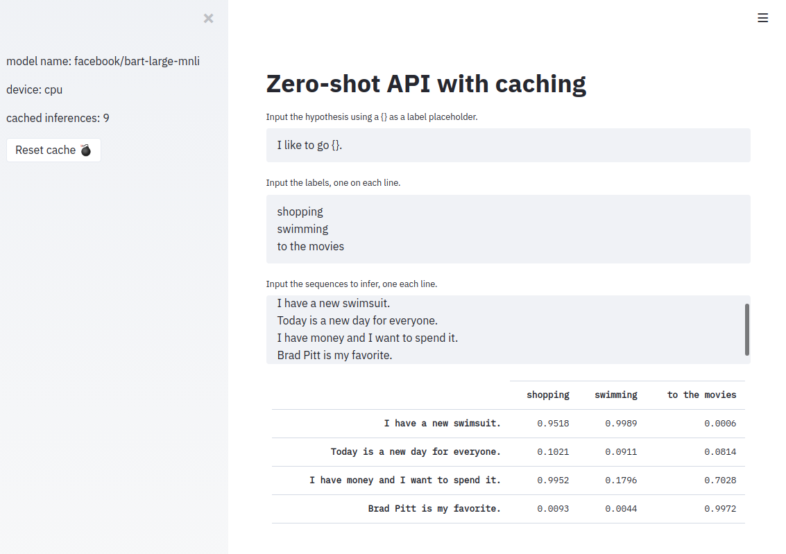

# Zero-shot API
[Zero-shot](https://joeddav.github.io/blog/2020/05/29/ZSL.html) inference with huggingface [transformers](https://huggingface.co/) using [fastapi](https://fastapi.tiangolo.com/) and caching with [Redis](https://github.com/andymccurdy/redis-py)

Install the requirements

    pip install -r requirements.txt

Start the service

    uvicorn api:app


Test the service:

```python
import requests
import pandas as pd

url = 'http://127.0.0.1:8000/infer'

params = {
    "hypothesis": "I like to go {}",
    "labels": ["shopping", "swimming"],
    "sequences": [
        "I have a new swimsuit.",
        "Today is a new day for everyone.",
        "I have money and I want to spend it.",
    ],
}

r = requests.get(base_url + "/infer", json=params)
df = pd.read_json(r.json())
print(df)
```

This gives

```
                                      shopping  swimming
I have a new swimsuit.                0.809227  0.969889
Today is a new day for everyone.      0.162844  0.186688
I have money and I want to spend it.  0.972724  0.384538
```

With the API running, you can experiment with a barebones streamlit interface:

    streamlit run streamlit_app.py

